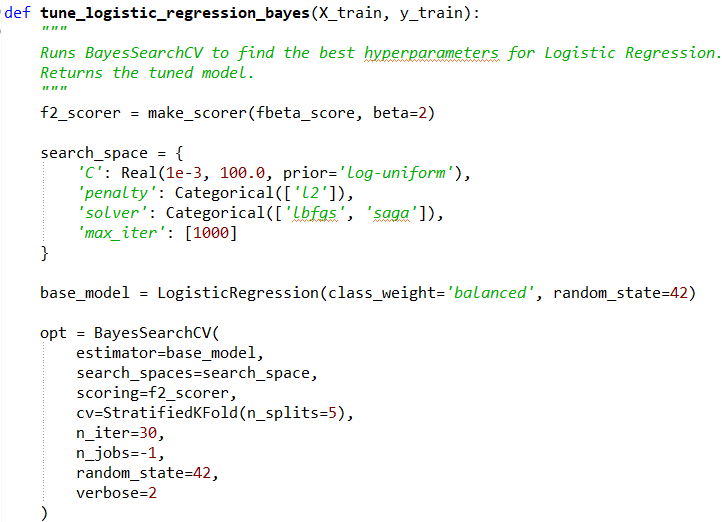

# 🧠 AI Stroke Risk Prediction Tool

This project simulates a clinical decision support system that estimates stroke risk using a machine learning ensemble. It was designed to demonstrate how **interpretable AI** can support early screening and proactive healthcare.

> **⚠️ Disclaimer:** This tool is for educational purposes only and is not intended for clinical use. Always consult a licensed healthcare provider for medical advice.

---

## 📌 Why This Project Matters

According to the CDC, someone in the U.S. experiences a stroke every 40 seconds. Early screening plays a critical role in reducing complications and improving outcomes especially in underdiagnosed or at-risk populations.

This project explores how machine learning can help estimate stroke-like risk using basic health information, making early screening more accessible and scalable.

---

## 📄 Final Presentation Report

📘 **[Click here to view the final presentation report (PDF)](https://jmedinacs.github.io/ai_stroke_risk_tool/stroke_risk_prediction_tool_report_jmedina.pdf)**  
This PDF was created as a polished summary of the project for a non-technical audience. It includes key visuals, model behavior explanations, and interpretation of the ensemble’s predictions.

This README serves as the **technical report**, detailing how the ensemble was built, tuned, and evaluated.

---

## 🔍 What the Tool Does

- Accepts real-time patient inputs via a Streamlit app
- Predicts stroke-like probability using a trained ensemble model
- Displays clear visual feedback and stroke-likeness interpretation
- Explains model reasoning using SHAP plots

---

## 🚀 Try the App

👉 [**Launch the Streamlit App**](https://aistrokerisktool.streamlit.app) 
Enter a basic health profile to view stroke-like risk, model interpretation, and age-based risk progression.

**Note:** *The app may sleep due to inactivity. If prompted, simply click “Wake up” and it will reload shortly.*

---

## 🔧 Key Features

- **Soft-Voting Ensemble** – Combines Logistic Regression and Random Forest (XGBoost tested but excluded)
- **Bayesian Hyperparameter Tuning** – Fine-tuned for F2 score optimization
- **F2-Based Threshold Selection** – Prioritizes recall to maximize stroke case detection
- **SHAP Explainability** – Includes both model-level and patient-level interpretability
- **Streamlit Interface** – Interactive and easy to use with sliders and dropdowns

---

## 🧹 Cleaning Process

For the full cleaning, EDA, and modeling logs, please view the [**logs**](https://docs.google.com/spreadsheets/d/1FsB1hhmC_nTjlGYU_96GUmwSr9y97NrgAw7h-C2clwM/edit?gid=1992881522#gid=1992881522).

Every model is only as good as its data, a thorough cleaning phase was essential to ensure accurate and reliable results. Standard cleaning steps such as text standardization, outlier detection, missing value imputation, and duplicate detection were performed.

The **major cleaning steps** include:

1. **Handling missing BMI values**  
   201 missing entries in the `bmi` column were imputed using the **median** (28.1) rather than the mean, due to strong right skew and outliers (max = 97.6). This helped preserve data integrity without inflating values.

2. **Removing extremely rare categories**  
   A single occurrence of `'other'` in the `gender` feature was removed to avoid introducing noise during encoding. This rare category offered no analytical value and could bias downstream models.

3. **Correcting binary feature interpretation**  
   During model evaluation, SHAP summaries revealed that `hypertension` and `heart_disease` were contributing very little to predictions, a result inconsistent with medical expectations. Further investigation showed that although these features were binary (0/1), they were not explicitly cast as categorical, causing the model to treat them as continuous variables after one-hot encoding.

   To address this, both features were manually cast to the `category` type before encoding. This ensured they were correctly treated as categorical features, allowing their predictive value to be recognized by the models.

---

## 🔍 Exploratory Data Analysis (EDA)

EDA was conducted to uncover patterns, identify potential predictors of stroke, assess feature distributions, and evaluate data quality before modeling. The key findings and steps are summarized below:

---

### 🧮 Numeric Feature Analysis

- `age` was relatively uniformly distributed with notable clusters around ages 55–60 and 70–80.
- `avg_glucose_level` exhibited **strong right skew**, with most values between 80–110 but a long tail beyond 150. Transformation may be necessary for sensitive models.
- `bmi` was slightly skewed to the right but resembled a normal distribution centered around 25–30.

⚠️ No transformation was applied during this phase, but skew and outliers were noted for potential downstream impact.

---

### 📊 Categorical Feature Distribution

- Gender: 58.6% female, 41.4% male
- Ever Married: 65.6% yes, 34.4% no
- Work Type: Diverse distribution, with 57% in private sector, and <1% “never worked”
- Smoking Status: 30% unknown, making it a potentially unreliable standalone feature

These distributions informed how categories were grouped, encoded, or handled during modeling.

---

### 🧪 Feature Significance Testing (Target: Stroke)

**Categorical vs Stroke (Chi-Squared Test):**

Statistically significant associations (p < 0.05) were found between stroke and:
- `heart_disease`
- `hypertension`
- `ever_married`
- `work_type`
- `smoking_status`

**Continuous vs Stroke (Point-Biserial Correlation):**

All three continuous features were statistically significant:
- `age`: Strongest predictor
- `avg_glucose_level`: Moderate predictor
- `bmi`: Weak but significant

---

### ⚖️ Target Distribution & Class Imbalance

Only **4.87%** of observations represent stroke cases, confirming a **severe class imbalance**. This guided the decision to use SMOTE and later SMOTE Tomek to ensure model reliability and avoid bias toward the majority class.

---

### 🧠 Multicollinearity & Feature Redundancy

Variance Inflation Factor (VIF) was calculated for all encoded features. No variable exceeded a VIF of 5, indicating **no multicollinearity** that would distort model coefficients or interpretation.

---

### 🔍 SHAP-Inspired Correction (Post-EDA Discovery)

Although `heart_disease` and `hypertension` were statistically significant in the chi-squared test, **SHAP summaries** revealed they were not contributing meaningfully to model predictions.  
This prompted a deeper review, revealing that these features, although binary, were **not explicitly cast as categorical**, and were incorrectly treated as continuous after one-hot encoding.  
Both features were re-cast as `category` type prior to encoding, resulting in **restored predictive value** and improved model alignment with medical expectations.

> 🧾 All steps and results were documented in detail in the [project log](https://docs.google.com/spreadsheets/d/1FsB1hhmC_nTjlGYU_96GUmwSr9y97NrgAw7h-C2clwM/edit?gid=767672527#gid=767672527).

---

## 🧠 Model Development and Ensemble Strategy

This section details how candidate models were selected, tuned, evaluated, and combined into a soft-voting ensemble designed to maximize recall without sacrificing interpretability.

---

### 3. 🛠️ Hyperparameter and Threshold Tuning

To maximize model performance, especially **recall**, which is critical in clinical risk prediction, a **two-stage optimization process** was conducted:

#### 🔧 Stage 1: Hyperparameter Tuning with BayesSearchCV
- Each candidate model (Logistic Regression, Random Forest, KNN, and XGBoost) were tuned using **BayesSearchCV**, a probabilistic optimization method that is more efficient than traditional grid search.
- The primary scoring metric during tuning was the **F2 score**, which emphasizes **recall** more heavily than precision.
- Example search spaces included:
  - **Logistic Regression**: Regularization strength (`C`), penalty type
  - **Random Forest**: Number of estimators, maximum depth, minimum samples per split
  - **XGBoost**: Learning rate, max depth, subsample ratio, number of trees

#### 🎯 Stage 2: Optimal Classification Threshold Search
- After training, each model’s predicted probabilities were evaluated across a range of **classification thresholds** (from 0.05 to 0.95 in 0.01 increments).
- A **custom grid search** was used to determine the threshold that maximized the **F2 score** on the validation set.
- This step ensured each model was not only well-tuned but also **calibrated to the project’s goal**: minimizing false negatives while preserving practical precision.

<details>
<summary>📄 Logistic Regression Tuning Example (BayesSearchCV)</summary>



The function below uses `BayesSearchCV` to tune a Logistic Regression model using `F2` as the scoring metric. Search space includes regularization strength, penalty type, solver, and max iterations.

</details>


> **Note:** *Recall* is the model's ability to correctly identify true positive stroke cases.  
---

## 📂 Project Structure

```
.
├── app_ui/                  # Streamlit app frontend
├── models/                  # Trained model and column order
├── src/                     # Preprocessing, training, evaluation modules
├── outputs/figures/         # SHAP plots, learning curves, evaluation charts
├── requirements.txt
├── README.md
```

---

## 👨‍💻 Author

John Paul Medina  
🔗 [LinkedIn](https://linkedin.com/in/jpmedinacs) | 🌐 [jmedina.in](https://jmedina.in)

---

## 📄 License

This project is licensed under the [MIT License](LICENSE).
