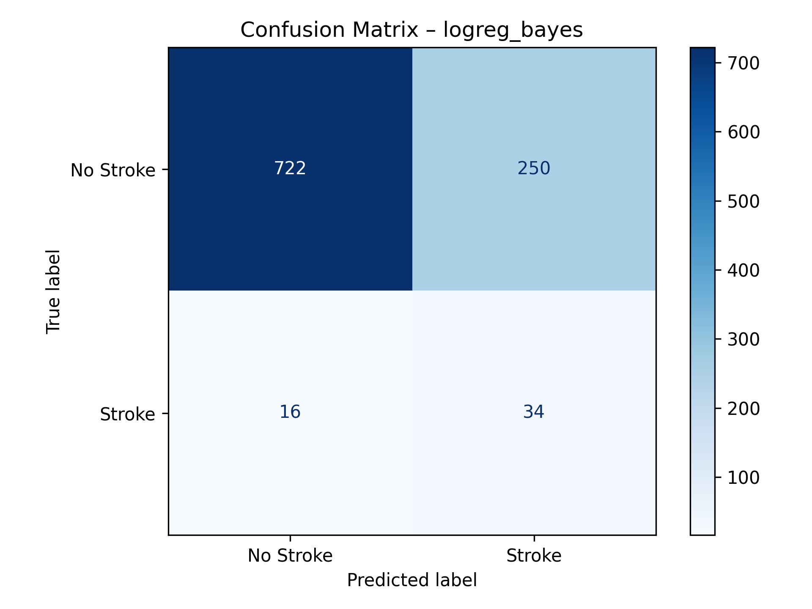
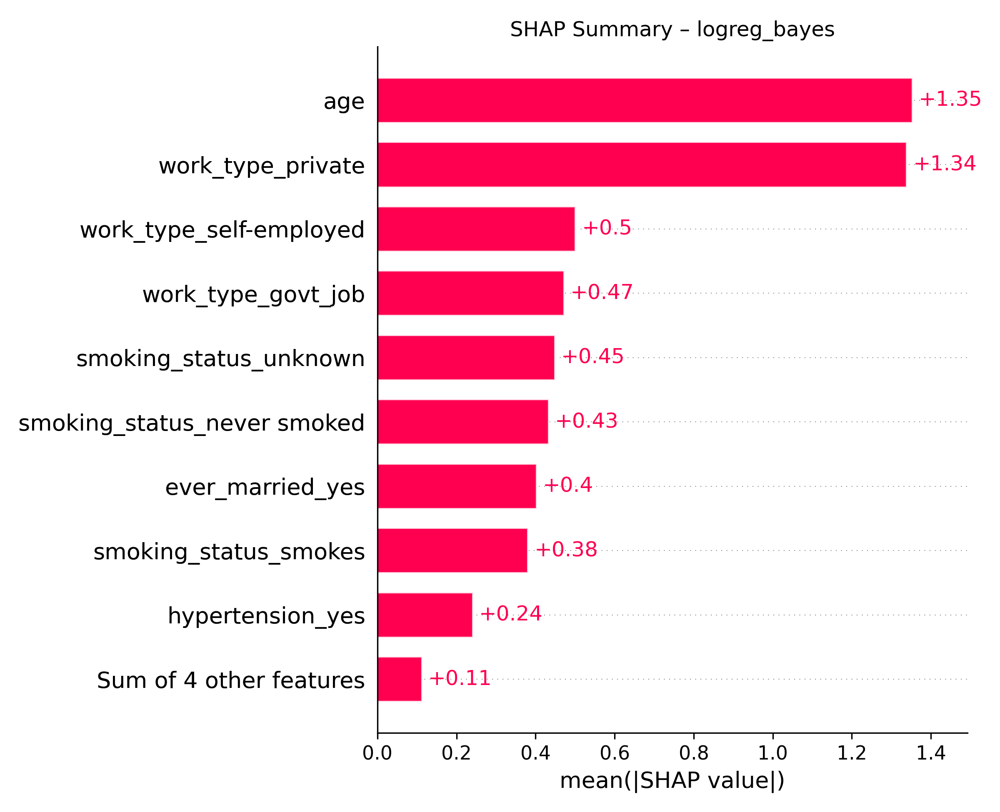
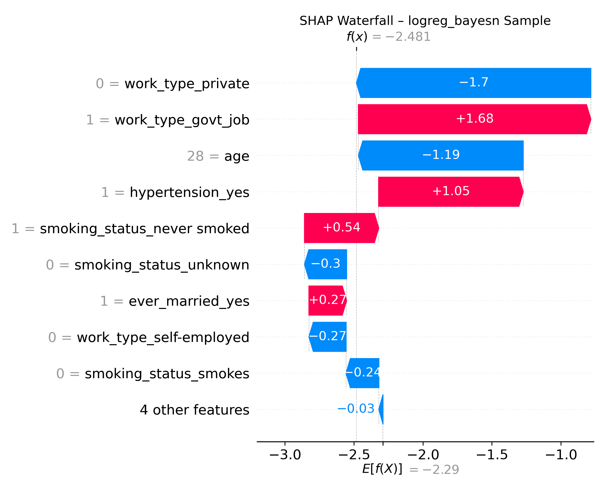
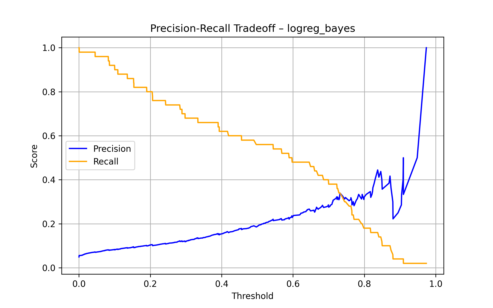
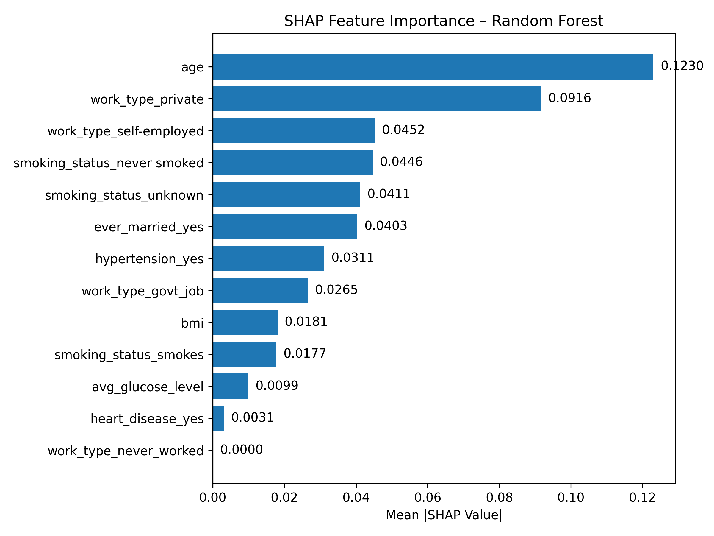
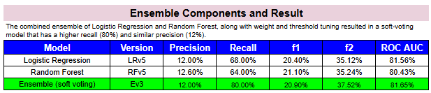
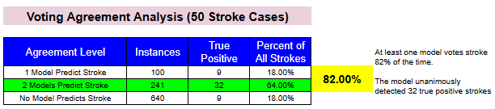
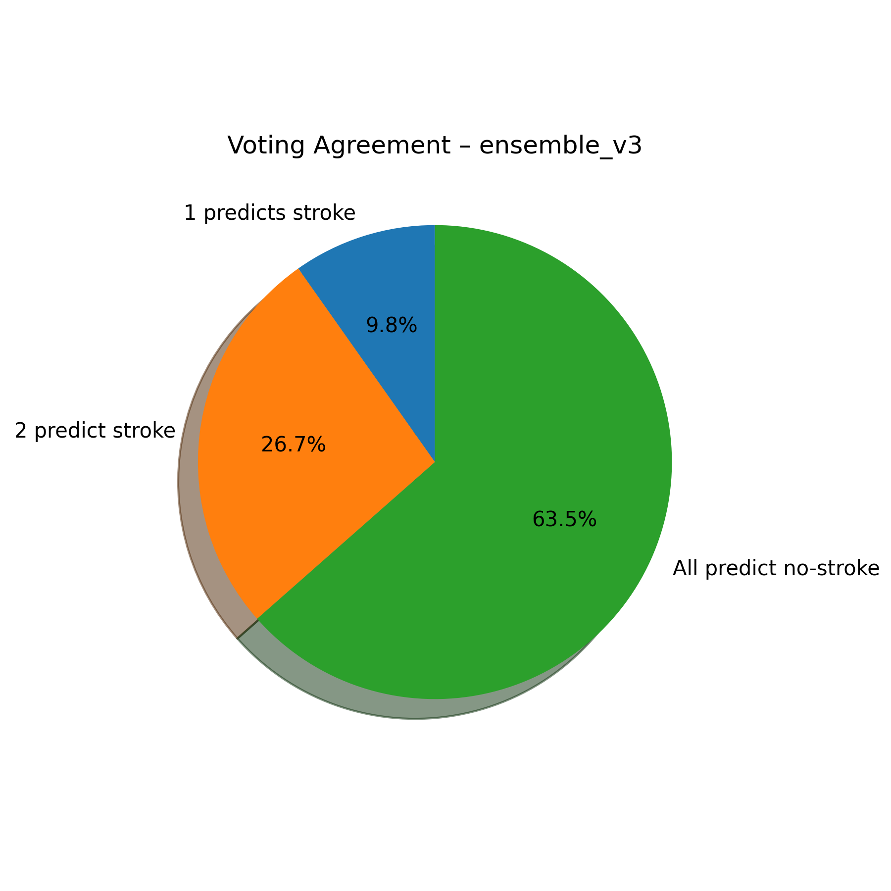
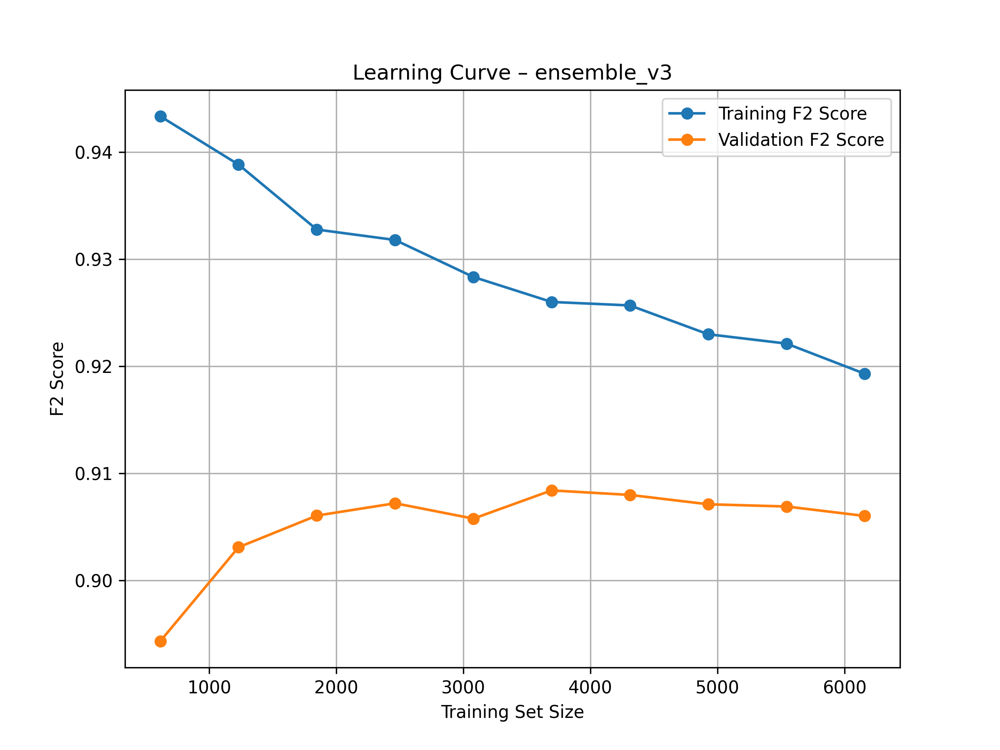

# 🧠 AI Stroke Risk Prediction Tool

This project simulates a clinical decision support system that estimates stroke risk using a machine learning ensemble. It was designed to demonstrate how **interpretable AI** can support early screening and proactive healthcare.

> **⚠️ Disclaimer:** This tool is for educational purposes only and is not intended for clinical use. Always consult a licensed healthcare provider for medical advice.

---

## 1. 📌 Why This Project Matters

According to the CDC, someone in the U.S. experiences a stroke every 40 seconds. Early screening plays a critical role in reducing complications and improving outcomes especially in underdiagnosed or at-risk populations.

This project explores how machine learning can help estimate stroke-like risk using basic health information, making early screening more accessible and scalable.

---

## 2. 📄 Final Presentation Report

📘 **[Click here to view the final presentation report (PDF)](https://jmedinacs.github.io/ai_stroke_risk_tool/stroke_risk_prediction_tool_report_jmedina.pdf)**  
This PDF was created as a polished summary of the project for a non-technical audience. It includes key visuals, model behavior explanations, and interpretation of the ensemble’s predictions.

This README serves as the **technical report**, detailing how the ensemble was built, tuned, and evaluated.

---

## 3. 🔍 What the Tool Does

- Accepts real-time patient inputs via a Streamlit app
- Predicts stroke-like probability using a trained ensemble model
- Displays clear visual feedback and stroke-likeness interpretation
- Explains model reasoning using SHAP plots

---

## 4. 🚀 Try the App

👉 [**Launch the Streamlit App**](https://aistrokerisktool.streamlit.app) 
Enter a basic health profile to view stroke-like risk, model interpretation, and age-based risk progression.

**Note:** *The app may sleep due to inactivity. If prompted, simply click “Wake up” and it will reload shortly.*

---

## 5. 🔧 Key Features

- **Soft-Voting Ensemble** – Combines Logistic Regression and Random Forest (XGBoost tested but excluded)
- **Bayesian Hyperparameter Tuning** – Fine-tuned for F2 score optimization
- **F2-Based Threshold Selection** – Prioritizes recall to maximize stroke case detection
- **SHAP Explainability** – Includes both model-level and patient-level interpretability
- **Streamlit Interface** – Interactive and easy to use with sliders and dropdowns

---

## 6. 🧹 Cleaning Process

For the full cleaning, EDA, and modeling logs, please view the [**logs**](https://docs.google.com/spreadsheets/d/1FsB1hhmC_nTjlGYU_96GUmwSr9y97NrgAw7h-C2clwM/edit?gid=1992881522#gid=1992881522).

Every model is only as good as its data, a thorough cleaning phase was essential to ensure accurate and reliable results. Standard cleaning steps such as text standardization, outlier detection, missing value imputation, and duplicate detection were performed.

The **major cleaning steps** include:

1. **Handling missing BMI values**  
   201 missing entries in the `bmi` column were imputed using the **median** (28.1) rather than the mean, due to strong right skew and outliers (max = 97.6). This helped preserve data integrity without inflating values.

2. **Removing extremely rare categories**  
   A single occurrence of `'other'` in the `gender` feature was removed to avoid introducing noise during encoding. This rare category offered no analytical value and could bias downstream models.

3. **Correcting binary feature interpretation**  
   During model evaluation, SHAP summaries revealed that `hypertension` and `heart_disease` were contributing very little to predictions, a result inconsistent with medical expectations. Further investigation showed that although these features were binary (0/1), they were not explicitly cast as categorical, causing the model to treat them as continuous variables after one-hot encoding.

   To address this, both features were manually cast to the `category` type before encoding. This ensured they were correctly treated as categorical features, allowing their predictive value to be recognized by the models.

---

## 7. 🔍 Exploratory Data Analysis (EDA)

EDA was conducted to uncover patterns, identify potential predictors of stroke, assess feature distributions, and evaluate data quality before modeling. The key findings and steps are summarized below:

---

### 🧮 Numeric Feature Analysis

- `age` was relatively uniformly distributed with notable clusters around ages 55–60 and 70–80.
- `avg_glucose_level` exhibited **strong right skew**, with most values between 80–110 but a long tail beyond 150. Transformation may be necessary for sensitive models.
- `bmi` was slightly skewed to the right but resembled a normal distribution centered around 25–30.

⚠️ No transformation was applied during this phase, but skew and outliers were noted for potential downstream impact.

---

### 📊 Categorical Feature Distribution

- Gender: 58.6% female, 41.4% male
- Ever Married: 65.6% yes, 34.4% no
- Work Type: Diverse distribution, with 57% in private sector, and <1% “never worked”
- Smoking Status: 30% unknown, making it a potentially unreliable standalone feature

These distributions informed how categories were grouped, encoded, or handled during modeling.

---

### 🧪 Feature Significance Testing (Target: Stroke)

**Categorical vs Stroke (Chi-Squared Test):**

Statistically significant associations (p < 0.05) were found between stroke and:
- `heart_disease`
- `hypertension`
- `ever_married`
- `work_type`
- `smoking_status`

**Continuous vs Stroke (Point-Biserial Correlation):**

All three continuous features were statistically significant:
- `age`: Strongest predictor
- `avg_glucose_level`: Moderate predictor
- `bmi`: Weak but significant

---

### ⚖️ Target Distribution & Class Imbalance

Only **4.87%** of observations represent stroke cases, confirming a **severe class imbalance**. This guided the decision to use SMOTE and later SMOTE Tomek to ensure model reliability and avoid bias toward the majority class.

---

### 🧠 Multicollinearity & Feature Redundancy

Variance Inflation Factor (VIF) was calculated for all encoded features. No variable exceeded a VIF of 5, indicating **no multicollinearity** that would distort model coefficients or interpretation.

---

### 🔍 SHAP-Inspired Correction (Post-EDA Discovery)

Although `heart_disease` and `hypertension` were statistically significant in the chi-squared test, **SHAP summaries** revealed they were not contributing meaningfully to model predictions.  
This prompted a deeper review, revealing that these features, although binary, were **not explicitly cast as categorical**, and were incorrectly treated as continuous after one-hot encoding.  
Both features were re-cast as `category` type prior to encoding, resulting in **restored predictive value** and improved model alignment with medical expectations.

> 🧾 All steps and results were documented in detail in the [project log](https://docs.google.com/spreadsheets/d/1FsB1hhmC_nTjlGYU_96GUmwSr9y97NrgAw7h-C2clwM/edit?gid=767672527#gid=767672527).

---

## 8. 🧠 Model Development and Ensemble Strategy

This section details how candidate models were selected, tuned, evaluated, and combined into a soft-voting ensemble designed to maximize recall without sacrificing interpretability.

---

### 📊 Understanding the Evaluation Metrics

To evaluate model performance, we used several classification metrics. In the context of stroke prediction, we prioritized **recall** and **F2 score** to minimize false negatives because *missing a stroke case is far more costly than a false alarms*.

- **Precision**: Out of all patients predicted to have a stroke, how many actually did have a stroke?  
  High precision = few false positives.

- **Recall**: Out of all patients who actually had a stroke, how many did we catch?  
  High recall = few false negatives.

- **F1 Score**: The harmonic mean of precision and recall. A balanced metric when both precision and recall are treated as equally important.

- **F2 Score**: Like F1, but gives more weight to **recall**.  
  In this project, **F2 is our main metric**, because **identifying stroke cases is more important than avoiding false positives**.

- **ROC AUC**: Measures the model’s ability to distinguish between stroke and no-stroke cases across all thresholds. Higher is better.

> ⚠️ **Key takeaway:** We optimized for **F2** to reduce the risk of **missed stroke cases**, even if it means occasionally flagging a non-stroke patient for follow-up.

---

### 🛠️ Hyperparameter and Threshold Tuning

To maximize model performance, especially **recall**, which is critical in clinical risk prediction, a **two-stage optimization process** was conducted:

#### 🔧 Stage 1: Hyperparameter Tuning with BayesSearchCV
- Each candidate model (Logistic Regression, Random Forest, KNN, and XGBoost) were tuned using **BayesSearchCV**, a probabilistic optimization method that is more efficient than traditional grid search.
- The primary scoring metric during tuning was the **F2 score**, which emphasizes **recall** more heavily than precision.
- Example search spaces included:
  - **Logistic Regression**: Regularization strength (`C`), penalty type
  - **Random Forest**: Number of estimators, maximum depth, minimum samples per split
  - **XGBoost**: Learning rate, max depth, subsample ratio, number of trees

#### 🎯 Stage 2: Optimal Classification Threshold Search
- After training, each model’s predicted probabilities were evaluated across a range of **classification thresholds** (from 0.05 to 0.95 in 0.01 increments).
- A **custom grid search** was used to determine the threshold that maximized the **F2 score** on the validation set.
- This step ensured each model was not only well-tuned but also **calibrated to the project’s goal**: minimizing false negatives while preserving practical precision.


*BayesSearchCV tuning function for Logistic Regression. The model was optimized for F2 score using a log-uniform search over regularization strength and categorical solvers.*

> **Note:** *Recall* is the model's ability to correctly identify true positive stroke cases.  

---

### 🧠 Model Selection and Evaluation

Four machine learning models were tained and evaluated using the same F2-optimized tuning and validation framework. Below is a brief summary of each model’s role and performance in the project.

#### 🔍 Logistic Regression

Logistic Regression is a linear classification algorithm that estimates the probability of a binary outcome (stroke vs. no stroke) based on input features. It applies a logistic (sigmoid) function to a weighted sum of the input variables, producing a probability between 0 and 1.

Because this model is linear and interpretable, each feature’s coefficient (or SHAP value) can be directly examined to understand its direction and strength of influence. This transparency makes it especially valuable in healthcare, where understanding *why* a model made a prediction is just as important as the prediction itself.

---

**🧪 Confusion Matrix**  
The matrix below shows how Logistic Regression performed on the test set. It correctly identified **34 out of 50 stroke cases**, achieving the **highest recall** among all models — a crucial outcome in a clinical screening context.



---

**📊 Evaluation Metrics (All Models)**  
This table compares the best-performing versions of all models across key metrics. Logistic Regression led in **recall** and **F2 score**, supporting its selection as the backbone of the final ensemble.


---

**🧠 SHAP Summary (Logistic Regression)**  
The SHAP summary plot highlights which features most strongly influenced stroke risk predictions. Top contributors included **age**, **average glucose level**, and **heart disease** — in line with known medical risk factors.



---

**🔍 SHAP Waterfall: Individual Prediction Example**  
This waterfall plot breaks down how the model evaluated a specific patient. Each feature's contribution (positive or negative) is shown, culminating in the final stroke risk score. This adds transparency and interpretability to individual-level predictions.



---

**📈 Precision-Recall Curve**  
This curve illustrates the trade-off between precision and recall across different classification thresholds. It confirms that the model performs best with thresholds tuned specifically for **high recall**, which aligns with the clinical priority of minimizing false negatives.



---

#### 🌲 Random Forest

Random Forest is an ensemble tree-based model that builds multiple decision trees and combines their outputs for more robust predictions. It’s known for handling nonlinear relationships and offering built-in feature importance.

While Random Forest performed slightly behind Logistic Regression in recall, it demonstrated strong overall metrics and interpretability. It was included in the final ensemble for its stability and complementary decision patterns.

**🧠 SHAP Summary (Random Forest)**  
The SHAP summary for Random Forest revealed similar feature importance to Logistic Regression, with **age**, **glucose level**, and **heart disease** ranking among the top contributors.



---

#### 👥 K-Nearest Neighbors (KNN)

KNN is a distance-based, non-parametric algorithm that classifies new data points based on the majority class of its closest neighbors. While intuitive, KNN tends to perform poorly on imbalanced and high-dimensional data.

In our testing, KNN showed the **lowest precision** and weakest generalization performance. It correctly identified 50% of stroke cases but at the cost of many false positives. Due to its instability and lack of interpretability, KNN was excluded from the final ensemble.

---

#### ⚡ XGBoost

XGBoost is a gradient-boosted decision tree model known for its accuracy and performance on structured data. It produced the **highest precision** among all models, but its **recall was low**, identifying fewer actual stroke cases.

Given the project’s clinical goal of minimizing false negatives, XGBoost was excluded from the final ensemble to avoid reducing overall recall. However, its strong performance in other metrics highlights its value in less recall-sensitive contexts.

---

> **Logistic Regression** achieved the **highest recall and F2 score**, making it the foundation of the final ensemble.

- Interpretable coefficients
- Transparent feature contributions (via SHAP)
- Clinical alignment with risk factor importance

For a side-by-side comparison of all model performance metrics, refer to the evaluation table above.

---

### 🧩 Ensemble Design & Optimization

After evaluating all candidate models individually, a **soft-voting ensemble** was constructed by combining the strengths of multiple models and further improve stroke case detection.

---

#### 🤔 Why Soft Voting?

Ensemble learning theory shows that **multiple moderately strong models** can be combined to produce a **more powerful predictor than any single model alone**, especially when those models are diverse in structure and decision boundaries.

As Leo Breiman (1996) and others demonstrated, the strength of an ensemble lies not in perfect individual models, but in **diversity and complementary strengths**. This principle supports using soft-voting, even when individual models like Logistic Regression and Random Forest are not flawless on their own.

**Soft voting** works by averaging the predicted probabilities of each model and making a final classification based on a defined threshold. Compared to more complex methods like stacking or bagging:

- **Stacking** requires training a meta-model and increases computational and interpretability complexity.
- **Bagging** improves unstable learners like decision trees but is less flexible when combining different model types.

A soft voting model was chosen for its **simplicity**, **transparency**, and ability to blend the strengths of **interpretable (Logistic Regression)** and **nonlinear (Random Forest)** models. It aligns with our goal of **high recall in clinical settings**, while preserving trust in model behavior.

---

#### 🧠 Models Included in the Ensemble

We included the two strongest models based on F2 score and recall:

- **Logistic Regression** (high recall, interpretable)
- **Random Forest** (complementary structure, stable predictions)

XGBoost and KNN were excluded due to low recall and interpretability challenges.

---

#### ⚖️ Voting Weights and Threshold Optimization

To build the ensemble:

- A **weighted soft voting** setup with adjustable model weights and classification thresholds is used in this project.
- A custom grid search tested various **(weight_LR, weight_RF)** combinations and thresholds from **0.05 to 0.95**.
- Optimization was driven by **F2 score**, prioritizing **recall without overly sacrificing precision**.

---

#### 💡 Key Insight

The final ensemble configuration achieved:

- **80% recall** (capturing 40 out of 50 stroke cases)
- **12% precision**
- **F2 score: 0.375**

This represents a **significant recall gain over individual models**, while maintaining **acceptable clinical precision**. The ensemble’s behavior aligned well with the project’s **early detection goal**, where **missing fewer stroke cases** is more valuable than perfect precision.

---

## 9. 📊 Soft-Voting Model Results & Discussion

The final soft-voting ensemble combined **Logistic Regression** and **Random Forest** to improve stroke case detection by averaging predicted probabilities and applying optimized thresholds.

---

### 🧮 Ensemble Performance Overview

The table below summarizes performance metrics for the final ensemble compared to its individual components:



- **Recall:** 80% — highest of any model
- **F2 Score:** 0.3752 — optimized for high recall
- **Precision:** 12% — acceptable for early screening, where false positives are preferable to missed cases
- **AUC:** 81.7% — showing strong overall classification ability

> This represents a significant recall gain over individual models without sacrificing interpretability or model integrity.

---

### 🗳️ Voting Agreement Breakdown

Voting behavior was analyzed across 50 stroke cases. The ensemble correctly flagged **82%** of stroke-positive patients through at least one model vote.




From the detailed voting analysis:

- In 100 cases, only 1 model predicted stroke → 9 true positives (18%)
- In 241 cases, both models predicted stroke → **32 true positives (64%)**
- Stroke was **missed entirely** (no models voted) in 9 cases

> The ensemble's **diversity in voting** allowed it to detect stroke cases that individual models might have missed, while reinforcing confidence when both models agreed.

---

### 📈 Learning Curve

The learning curve below shows how the ensemble’s F2 score changed as more training data was used. The F2 score is a metric that prioritizes **recall** — how well the model detects true stroke cases.



Key observations:

- **Validation F2 score improved steadily** as we increased the amount of training data, peaking between 4,000–5,000 samples.
- The **small gap** between the training and validation lines suggests the model is not overfitting (memorizing) the training data — it's **learning patterns that generalize well** to new, unseen patients.
- This means: **The more data we feed the model, the better it gets — up to a point.**

> Overall, the curve confirms that our ensemble model learns reliably from the data and remains stable as training size increases, which is a critical trait for future scaling in real-world medical settings.

---

### 💬 Interpretation

The ensemble achieved:

- **Recall of 80%** (40/50 stroke cases detected)
- **Precision of 12%**, consistent with earlier individual models
- **F2 optimization** aligned perfectly with our project's clinical goal: prioritize **early detection** of at-risk patients

> In clinical settings, **missing fewer strokes** is more important than avoiding all false alarms. This ensemble represents a practical, interpretable, and recall-driven approach to medical risk prediction.

---

## 10. 📘 Key Learnings & Takeaways

This project provided valuable insights not only into stroke risk modeling, but also into the practical challenges of building interpretable, high-recall clinical tools. Below are the key takeaways from the end-to-end process.

---

### 🔄 On Tuning and Thresholds

- **F2 optimization** gave us a powerful lens to prioritize recall in a clinical context, far more appropriate than optimizing for accuracy or F1.
- **Threshold tuning** mattered just as much as model tuning. Carefully adjusting decision thresholds helped us push recall higher without sacrificing all the precision.
- Logistic Regression benefited significantly from **threshold calibration**, while XGBoost struggled due to its inherent precision bias.

---

### 🧠 On Ensemble Behavior

- The ensemble **outperformed individual models**, particularly in recall, by combining the strengths of interpretable and nonlinear learners.
- **Voting agreement analysis** showed that even when one model missed a stroke case, the other often caught it, validating the value of diverse decision boundaries.
- This experience confirmed ensemble learning theory: **you don’t need perfect models, just diverse, competent ones**.

---

### 🔍 On Model Interpretability

- Using **SHAP** enhanced both technical evaluation and real-world explainability. We could confidently trace predictions back to medical risk factors like **age**, **heart disease**, and **glucose level**.
- SHAP also helped me catch a subtle issue: heart_disease and hypertension was contributing almost nothing to predictions, which didn’t make sense given what we know medically. 
That insight, combined with domain awareness, led me to believe and investigate that they were being misinterpreted as a continuous variable. If I hadn't understood the clinical relevance, I probably would have missed it.

---

### 💡 If We Had More Time or Data...

- We would experiment with **feature interactions** (e.g., age × heart_disease) and **nonlinear feature transformations**.
- We’d also explore **model calibration** to refine probability outputs for real-world triage.
- With more labeled cases, especially positive stroke cases, we could test **deep learning** or stacking ensembles with richer meta-models.

---

### ❤️ Human-Centric Takeaway

In clinical settings, the cost of **missing a stroke** is often far greater than the cost of a false positive.  
This project reinforced the importance of designing systems that **maximize trust** through both **recall** and **transparency**.

> A model that explains itself and errs on the side of caution is far more valuable in healthcare than one that is merely "accurate."

---

## 11. 📂 Project Structure, Modularization, and Reproducibility

The project is organized to reflect a clear separation of concerns across preprocessing, modeling, evaluation, and deployment.

```text
ai_stroke_risk_tool/
├── src/
│   ├── eda/                        # Exploratory data analysis utilities
│   ├── evaluation/                # Manual testing and diagnostics
│   ├── pipeline/                  # End-to-end pipeline orchestration (EDA, VIF, ensemble builder)
│   ├── preprocessing/             # Cleaning and preprocessing scripts
│   ├── training/                  # Individual model training scripts (LR, RF, KNN, XGBoost)
│   ├── utils/                     # Shared utilities (e.g., config, helpers)
│   └── app_ui/                    # Streamlit app backend
│
├── data/                          # Raw and processed input data
├── docs/                          # Visuals and documentation assets
├── models/                        # Trained model files (saved with joblib)
├── outputs/                       # Charts, evaluation metrics, exportable results
├── report/                        # Report source files or final deliverables
├── app+stream.py                  # Entry point for the deployed Streamlit app
├── requirements.txt               # Python dependencies
├── LICENSE
└── README.md
```

---

---

### 🧩 Modular Code Design

Each component of the workflow is modularized into separate scripts, allowing for clean, testable, and reusable logic across the pipeline.

The full end-to-end process is orchestrated through a single `main()` function that ties together all major steps — from data cleaning to model training to ensemble diagnostics.

```python
# src/pipeline/main.py

from preprocessing.clean_the_data import clean_data
from preprocessing.data_preprocessing import preprocess_data 
from pipeline.eda_driver import run_eda
from training.train_logistic_regression import train_logistic_regression_model
from training.train_rf import train_random_forest_model
from training.train_xgboost import train_xgboost_model 
from training.train_knn import train_knn_model
from pipeline.compare_models import summarize_results
from pipeline.create_ensemble_voting_model import run_voting_pipeline 
from pipeline.check_vif import preprocess_data_for_LR
from evaluation.ensemble_diagnostic import run_ensemble_diagnostics

def main():
    """
    Runs the full stroke risk pipeline:
    1. Cleaning → 2. Preprocessing → 3. EDA → 4. VIF → 
    5. Model training → 6. Comparison → 7. Ensemble → 8. Diagnostics
    """
    df = clean_data()
    df = preprocess_data()
    run_eda()
    preprocess_data_for_LR()
    train_logistic_regression_model()
    train_random_forest_model()
    train_xgboost_model()
    train_knn_model()
    summarize_results()
    run_voting_pipeline()
    run_ensemble_diagnostics()

if __name__ == '__main__':
    main()
```

---


## 12. 📦 Reproducibility

This project was built to be fully modular and reproducible from cleaning to modeling to app deployment with minimal setup required.

---

### 🗂️ 1. Cloning the Repository

```bash
git clone https://github.com/your-username/ai_stroke_risk_tool.git
cd ai_stroke_risk_tool
```

> ✅ Python 3.9+ is recommended

---

### 📦 2. Installing Dependencies

Use the provided `requirements.txt` file to install all necessary packages:

```bash
pip install -r requirements.txt
```

> For a clean setup, use a virtual environment:
```bash
python -m venv venv
source venv/bin/activate  # or .env\Scriptsctivate on Windows
```

---

### 📁 3. Data Access (Not Included in Repo)

Due to data license and privacy considerations, **raw data is not included in this repository**.

To reproduce the project:
- Download the **Stroke Prediction Dataset** from [Kaggle](https://www.kaggle.com/datasets/fedesoriano/stroke-prediction-dataset)
- Place the file in the `data/raw` folder
- Ensure it matches the expected filename: `stroke_data.csv`

---

### 🧪 4. Running the Full Pipeline

To run the complete modeling pipeline and generate all results and diagnostics:

```bash
python src/pipeline/main.py
```

This script will:
- Clean and preprocess the data
- Run EDA and VIF checks
- Train all models and create the ensemble
- Generate evaluation results, SHAP visualizations, and diagnostics

---

### 🌐 5. Running the Streamlit App

You can try the live version of the stroke risk prediction tool here:

🔗 [Launch the Streamlit App](https://aistrokerisktool.streamlit.app/)

> No installation required — view predictions, SHAP explanations, and model behavior directly in your browser.

---

### 🧾 Additional Notes

- All outputs (charts, tables) are saved to the `outputs/` directory
- Trained models are saved in `models/` using `joblib`
- The project is modular and extendable for use with other medical datasets

---

## 13. 👨‍💻 Author

John Paul Medina  
🔗 [LinkedIn](https://linkedin.com/in/jpmedinacs) | 🌐 [jmedina.in](https://jmedina.in)

---

## 📄 License

This project is licensed under the [MIT License](LICENSE).
