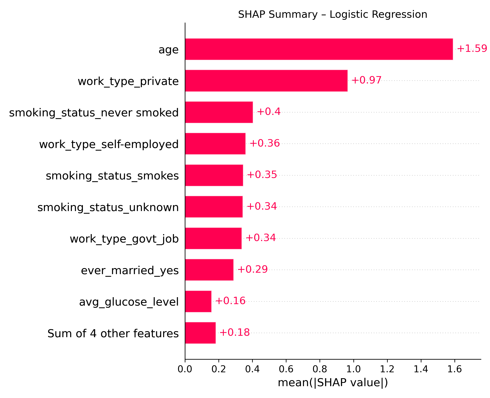

# AI Stroke Risk Prediction Tool

This project simulates a clinical decision support tool that uses machine learning to estimate stroke risk based on basic health profile inputs. It is designed to demonstrate how interpretable AI can support proactive healthcare decisions and early screening efforts.

> **Disclaimer:** This tool is for educational purposes only. It is not approved for clinical use and must not be used for diagnosis or treatment. Always consult a healthcare provider for medical advice.

---

## 🔍 What It Does

- Predicts stroke-like patterns using a trained ensemble model
- Accepts real-time patient inputs via a Streamlit web app
- Returns a probability score with clear visual feedback
- Provides stroke-likeness interpretation and model transparency through SHAP

---

## 🔧 Key Features

- **Soft-Voting Ensemble** – Combines Logistic Regression, Random Forest, and XGBoost
- **Bayesian Hyperparameter Tuning** – Uses BayesSearchCV for optimized model performance
- **F2-Based Threshold Selection** – Prioritizes recall for early stroke detection
- **SHAP Explainability** – Includes model summary plots and patient-level explanations
- **Streamlit Interface** – Interactive web app with sliders and dropdowns

---

## 📈 Final Model Performance

| Model               | Precision | Recall | F1 Score | F2 Score | ROC AUC |
|--------------------|-----------|--------|----------|----------|---------|
| Logistic Regression | 0.113     | 0.780  | 0.197    | 0.358    | 0.814   |
| Random Forest       | 0.116     | 0.660  | 0.198    | 0.341    | 0.796   |
| XGBoost             | 0.168     | 0.520  | 0.254    | 0.366    | 0.791   |
| **Voting Ensemble** | **0.149** | **0.680** | **0.244** | **0.397** | **0.823** |

🧠 The ensemble model was selected for its **balanced performance and highest F2 score**, achieving **68% recall** and a precision of 14.9%.

---

## 🖼 Sample Visual Insights

### SHAP Value Summary – Logistic Regression


### SHAP Waterfall – Single Prediction


### Ensemble Learning Curve


---

## 🧪 Sample Code Snippet

```python
def make_prediction(model, input_df, column_order):
    df_encoded = pd.get_dummies(input_df)
    df_encoded = df_encoded.reindex(columns=column_order, fill_value=0)
    return model.predict_proba(df_encoded)[0, 1]
```

---

## 🚀 Try the App

[Click here to launch the Streamlit app](https://aistrokerisktool.streamlit.app) _(opens in a new tab)_

---

## 📂 Project Structure

```
.
├── app_ui/                  # Streamlit app frontend
├── models/                  # Trained model and column order
├── src/                     # Preprocessing, training, evaluation modules
├── outputs/figures/         # SHAP plots, learning curves, evaluation charts
├── requirements.txt
├── README.md
```

---

## 👨‍💻 Author

John Paul Medina  
🔗 [LinkedIn](https://linkedin.com/in/jpmedinacs) | 🌐 [jmedina.in](https://jmedina.in)

---

## 📄 License

This project is licensed under the [MIT License](LICENSE).
