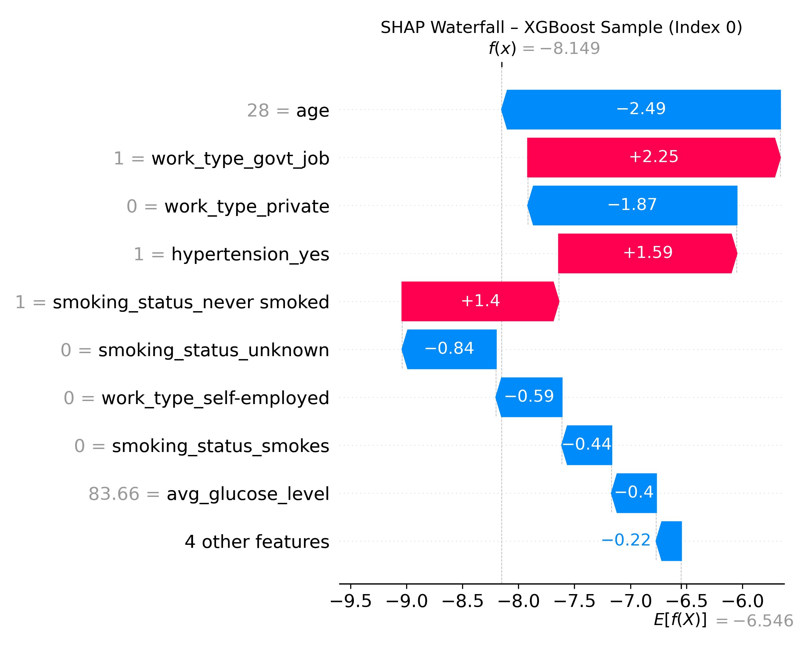

# AI Stroke Risk Predictor

This project simulates a clinical decision support tool that uses machine learning to estimate stroke risk based on demographic and health-related features. It’s designed to demonstrate how interpretable AI can support proactive healthcare interventions.

> **Disclaimer:** This tool is for educational purposes only. It is not approved for clinical use and must not be used for diagnosis or treatment. Always consult a healthcare provider for medical advice.

---

## What It Does

- Predicts stroke-like patient profiles using a trained ensemble model (Logistic Regression, Random Forest, XGBoost, KNN)
- Accepts real-time patient inputs through a Streamlit web app
- Returns probability score, color-coded severity feedback, and clear recommendations
- Uses SHAP values for model explainability and transparency

---

## Key Features

- **Ensemble Modeling** – Combines multiple classifiers via soft voting for better performance
- **One-Hot Encoded Features** – Ensures proper handling of categorical patient inputs
- **Class Imbalance Handling** – Uses SMOTE to balance stroke vs. non-stroke cases
- **Model Interpretability** – SHAP summary plots and waterfall explanations
- **Streamlit Interface** – User-friendly web tool with sliders and dropdowns

---

## Model Highlights

| Model                      | Precision | Recall | F1 Score | F2 Score | AUC-ROC |
|---------------------------|-----------|--------|----------|----------|---------|
| Logistic Regression (Bayes) | 0.113     | 0.780  | 0.197    | 0.358    | 0.814   |
| Random Forest (Bayes)       | 0.116     | 0.660  | 0.198    | 0.341    | 0.796   |
| XGBoost (Bayes)             | 0.168     | 0.520  | 0.254    | 0.366    | 0.791   |

🧠 **Final Model:** XGBoost was selected for its high F2 score (0.366) and balanced precision-recall trade-off.

Note: Probabilities rarely exceed 60% due to the class imbalance (~5% stroke cases). A prediction of 40–60% is still meaningful.

---

## Sample Visual Insights & Interpretation

### SHAP Value Summary – XGBoost


### SHAP Waterfall – Single Prediction


### Precision-Recall Curve


---

## Sample Code Snippet

```python
def make_prediction(model, input_df, column_order):
    df_encoded = pd.get_dummies(input_df)
    df_encoded = df_encoded.reindex(columns=column_order, fill_value=0)
    return model.predict_proba(df_encoded)[0, 1]
```

---

## Run the App

### Setup

```bash
git clone https://github.com/YOUR_USERNAME/stroke_risk_prediction_ml.git
cd stroke_risk_prediction_ml
pip install -r requirements.txt
```

### Launch App
```bash
streamlit run app_ui/app_stream.py
```

---

## Project Structure

```
.
├── app_ui/                  # Streamlit app frontend
├── models/                  # Trained model and feature order
├── src/                     # Preprocessing, training, evaluation
├── requirements.txt
├── README.md
```

---

## Author

John Paul Medina  
🔗 [LinkedIn](https://linkedin.com/in/jpmedinacs) | 🌐 [jmedina.in](https://jmedina.in)  

---

## License

This project is licensed under the [MIT License](LICENSE).
